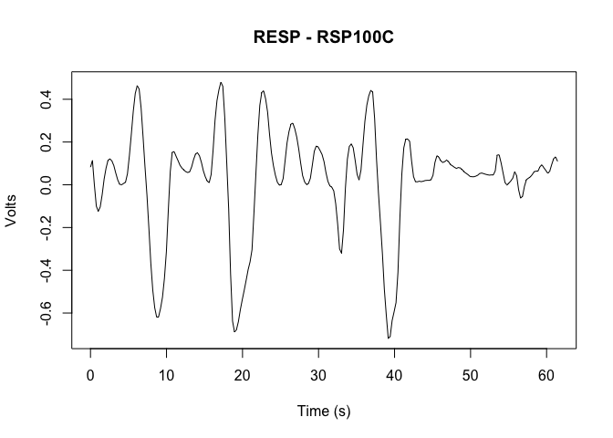

<!-- README.md is generated from README.Rmd. Please edit that file -->

# bioread

This library provides an R interface to reading AcqKnowledge files
collected using a BIOPAC data recording system. It uses reticulate to
get data from the underlying python package:

<https://github.com/uwmadison-chm/bioread>

## Installation

You can install the development version of bioread from GitHub:

``` r

# install.packages("devtools")
devtools::install_github("uwmadison-chm/rbioread")
#> Downloading GitHub repo uwmadison-chm/rbioread@HEAD
#> 
#> ── R CMD build ─────────────────────────────────────────────────────────────────
#> * checking for file ‘/private/var/folders/pr/vfv_wh0x7_n25fgb9zjf1bw80000gn/T/RtmpcQcgku/remotes125c85fd2f1c9/uwmadison-chm-rbioread-1255fee/DESCRIPTION’ ... OK
#> * preparing ‘bioread’:
#> * checking DESCRIPTION meta-information ... OK
#> * checking for LF line-endings in source and make files and shell scripts
#> * checking for empty or unneeded directories
#> * building ‘bioread_1.0.0.tar.gz’
#> Installing package into '/private/var/folders/pr/vfv_wh0x7_n25fgb9zjf1bw80000gn/T/Rtmp1WK3LL/temp_libpath11d377824bcdb'
#> (as 'lib' is unspecified)
library(bioread)

# Check the installation
reticulate::py_module_available("bioread")
#> [1] TRUE
```

## Example

To load an .acq file and plot the first channel with nice names and
labels:

``` r

acq_file <- system.file("extdata", "physio-5.0.1-c.acq", package = "bioread")
acq_data <- bioread::read_acq(acq_file)

for (i in 1:length(acq_data$channels)) {
  cat("Channel ", i, ": ", acq_data$channel[[i]]$name, "\n")
}
#> Channel  1 :  EDA filtered, differentiated 
#> Channel  2 :  EKG - ERS100C 
#> Channel  3 :  RESP - RSP100C 
#> Channel  4 :  EDA - GSR100C
```

Let’s plot respiration, which is in channel 3:

``` r

channel <- acq_data$channels[[3]]

# Plot the first channel
plot(
   channel$time, channel$data, type = "l", xlab = "Time (s)",
   ylab = channel$units, main = channel$name)
```



## Advanced usage

Using reticulate to access the raw bioread functions and data structures
is not much more difficult.

``` r

acq_file <- system.file("extdata", "physio-5.0.1-c.acq", package = "bioread")

py_bioread <- reticulate::import("bioread")
py_acq_reader <- py_bioread$reader$Reader$read_headers(acq_file)

py_acq_reader$channel_dtype_headers[[1]]$numpy_dtype(TRUE)
#> [1] "<f8"
```

Remember that if you are passing list or array indexes as parameters to
python functions, you will need to use 0-based indexing:

``` r

acq_file <- system.file("extdata", "physio-5.0.1-c.acq", package = "bioread")

py_bioread <- reticulate::import("bioread")
py_acq_data <- py_bioread$read(acq_file, channel_indexes = 1:2)

for (i in 1:length(py_acq_data$channels)) {
  cat("Channel", i, "loaded:", py_acq_data$channels[[i]]$loaded, "\n")
}
#> Channel 1 loaded: FALSE 
#> Channel 2 loaded: TRUE 
#> Channel 3 loaded: TRUE 
#> Channel 4 loaded: FALSE

# Oops, we accidentally loaded channels 2 and 3
```

## Getting help

For most “this .acq file won’t load” issues, you’ll want to go to [the
original Python repository](https://github.com/uwmadison-chm/bioread)
and open an issue.

If the problem seems to be more on the R end of things, drop a note in
this one.
