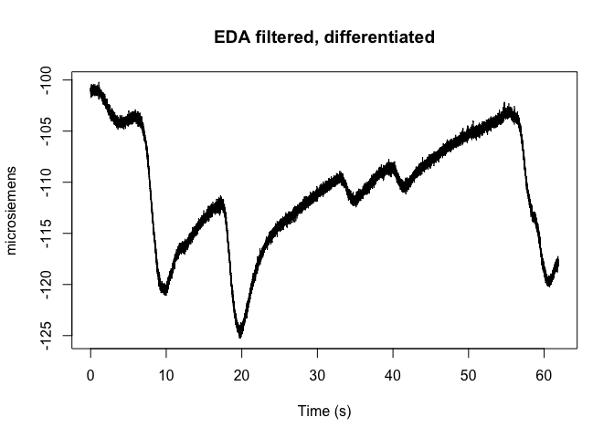

<!-- README.md is generated from README.Rmd. Please edit that file -->

# bioread

This library provides an R interface to reading AcqKnowledge files
collected using a BIOPAC data recording system. It uses reticulate to
get data from the underlying python package:

<https://github.com/uwmadison-chm/bioread>

## Installation

You can install the development version of bioread from GitHub:

``` r

# install.packages("devtools")
devtools::install_github("uwmadison-chm/rbioread")
```

## Example

To load an .acq file and plot the first channel with nice names and
labels:



## Advanced usage

Using reticulate to access the raw bioread functions and data structures
is not too much more difficult:

``` r

acq_file = system.file("extdata", "physio-5.0.1-c.acq", package = "bioread")

py_bioread = reticulate::import("bioread")
py_acq_reader = py_bioread$reader$Reader$read_headers(acq_file)

py_acq_reader$version_string
#> [1] "5.0.1"
```

## Getting help

For most “this .acq file won’t load” issues, you’ll want to go to [the
original Python repository](https://github.com/uwmadison-chm/bioread)
and open an issue.

If the problem seems to be more on the R end of things, drop a note in
this one.
